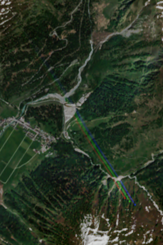
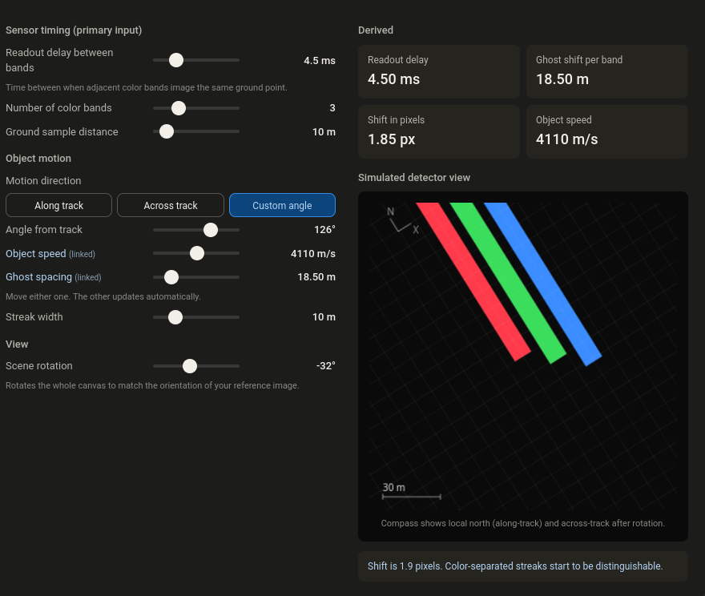

# s2rainbow

A rainbow caught in Sentinel-2 (S2) satellite imagery over Switzerland.

While browsing Copernicus Sentinel-2 L2A data I came across a rainbow-like artifact in a tonemapped natural color scene from 25 May 2026. I cannot explain how this artifact is actually generated. Instead of guessing at the mechanism, the widget in this repo takes the opposite approach: it calculates the properties that such an object would have if it were a real feature in the scene. The retreived parameters are not realistic, the proposed mechanism probably wrong.

## View it yourself

Open the exact scene in the Copernicus Browser:

<!-- NOTE: the URL you pasted was cut off at the start (it began mid value at "2572"),
     so lat=47.2572 below is a reconstruction to match lng=8.36869.
     Replace this whole link with your full Copernicus Browser URL if the center differs.
     The scene content is set by visualizationUrl / datasetId / time / layer, which are intact. -->
[Open in Copernicus Browser](https://browser.dataspace.copernicus.eu/?lat=47.2572&lng=8.36869&themeId=DEFAULT-THEME&visualizationUrl=U2FsdGVkX196xI7CfFHU5LIQz%2F9IERaHw8Y1hYgD80f0exrp064r8zfn0MxYRhgpC92srurSGmODUuV5KOSca4VIrJdPxDuQ4any51R2sTr8v3NPzbQPaMhj5mYeLTO3&datasetId=S2_L2A_CDAS&fromTime=2026-05-25T00%3A00%3A00.000Z&toTime=2026-05-25T23%3A59%3A59.999Z&layerId=2_TONEMAPPED_NATURAL_COLOR&demSource3D=MAPZEN&cloudCoverage=30&dateMode=SINGLE)

Scene details:

- Dataset: Sentinel-2 L2A (CDAS)
- Date: 25 May 2026
- Layer: Tonemapped Natural Color
- Center: 47.2572 N, 8.36869 E
- Max cloud coverage: 30%

## The rainbow

<!-- Adjust the filename to match the actual screenshot inside the rainbow_on_s2 folder -->

## Interactive widget

The widget calculates the properties the artifact would have if it were a real object in the scene. GitHub strips scripts and iframes out of rendered READMEs, so it cannot run inline here. Below is a static preview, with a link to the live version.

<!-- Adjust the filename to match your widget preview image -->

<!-- Replace <username> with your GitHub username once GitHub Pages is enabled for this repo.
     Alternatively, link the raw file through htmlpreview, e.g.
     https://htmlpreview.github.io/?https://github.com/<username>/s2rainbow/blob/main/widget/index.html -->
Live widget: [https://&lt;username&gt;.github.io/s2rainbow/](https://github.com/)
